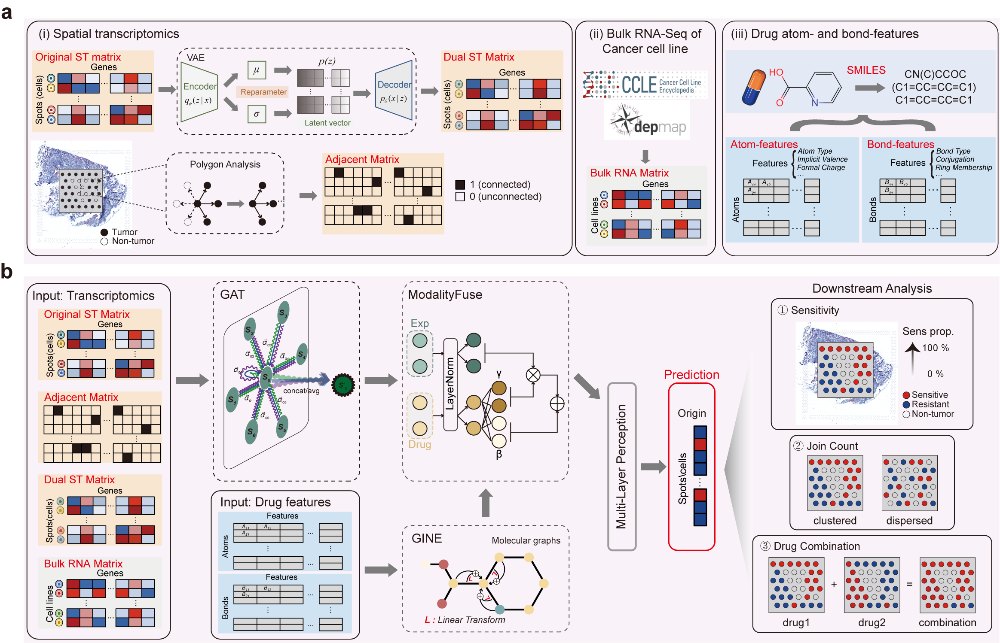

# M<sup>3</sup>Spade
[](https://zenodo.org/records/18211668)  
## Introduction
**M<sup>3</sup>Spade** (<ins>**M**</ins>ulti-<ins>**M**</ins>odal <ins>**M**</ins>odel for predicting <ins>**Spa**</ins>tial <ins>**D**</ins>rug <ins>**E**</ins>fficacy) is a versatile computational framework designed for predicting drug sensitivity in spatial transcriptomics data. It is resolution-agnostic, capable of processing data ranging from single-cell to spot-level resolutions, and supports generalizable prediction of responses to previously unseen drugs based on their chemical structures.

M<sup>3</sup>Spade enables the following tasks:

*   **Binarized Sensitivity Prediction**  
    Performs binary classification of drug sensitivity at the single-cell or spot level (Sensitive vs. Resistant).

*   **Spatial Autocorrelation Analysis**  
    Quantifies global spatial dependency and clustering patterns using **Join Count statistics**.

*   **Combinatorial Therapy Assessment**  
    Predicts and evaluates drug sensitivity outcomes for drug combinations.



## Requirements

> **Note:** We strongly recommend running M<sup>3</sup>Spade on a GPU for optimal performance.

Our experiments were conducted using Python 3.8.20 with CUDA 11.8. We recommend using Anaconda or Miniconda to create an isolated conda environment for running M<sup>3</sup>Spade.

**1. Create a virtual environment:**
```bash
conda create -n M3Spade python==3.8.20
```
**2. Activate the environment:**
```bash
conda activate M3Spade
```
**3. Install required packages:**

> We provide a shell script for dependency installation at [`env/pkg_install.sh`](env/pkg_install.sh).  

## Usage
```bash
Usage: M3Spade.py [options]

Required:
      --drug_name STRING: Name of the drug(s). For multiple drugs, separate with commas (e.g., "Gefitinib,Docetaxel")
      --species STRING: Species of the spatial data: "hs" (Human) or "mus" (Mouse)
      --spatial_count_path STRING: Path to the spatial count CSV file or H5 file
      --spatial_coord_path STRING: Path to the spatial category coordinate CSV file

Optional:
    # Hardware and Path
      --device STRING: Device to use: "gpu" or "cpu" (default: gpu)
    
    # Model Architecture
      --hiddens_graph STRING: Hidden layer dimensions for the graph network (default: 1024,512,128)
      --hiddens_linear STRING: Hidden layer dimensions for the linear network (default: 64,16)
      --drugFunc STRING: GNN function type for the drug graph: "GIN" or "GINE" (default: GIN)

    # Data Processing
      --gene_num INT: Number of highly variable genes to select (default: 500)
      --k_neigh INT: Number of neighbors for spatial graph (default: 6)
      --test_size FLOAT: Test split proportion (default: 0.2)
      --sampling STRING: Sampling strategy (default: SMOTE)
      
    # Training Hyperparameters
      --lr FLOAT: Learning rate (default: 0.001)
      --weight_decay FLOAT: Weight decay (default: 0.0001)
      --grad_clip FLOAT: Gradient clipping value (default: 1.0)
      --patience INT: Early stopping patience (default: 25)
      --warm_up INT: Warm-up epochs (default: 10)
      --dropout_rate FLOAT: Graph dropout rate (default: 0.3)
      --alpha FLOAT: TsallisEntropy parameter 1 (default: 1.8)
      --temperature FLOAT: TsallisEntropy parameter 2 (default: 2.5)
      --threshold FLOAT: Threshold parameter (default: 0.95)

    # Flags
      --save_mid BOOL: Flag to save intermediate calculation results (True/False) (default: False)
      --perform_normalize BOOL: Whether to perform filtering and log-normalization on spatial data (True/False) (default: True)
```

我们基于六个单细胞金标准数据集产生了pseudo-spatial数据进行了模型测试，选择了均获得良好效果的公共参数作为default参数设置，可适应大部分任务，也可作为个性化参数调整的起始点。

We provided ten examples 分别为MC38、B16、hCRC各自三张片子以及一张hCRC的visium HD片子show you how to use M<sup>3</sup>Spade to 预测空间转录组药物响应。We have uploaded all examples datasets to Zenodo, which can be obtained from [`here`](https://zenodo.org/records/18211668). Please download 然后把data directory放在和M3Spade.py同级的目录下。所有片子的训练模型以及预测结果也在Zenodo的model_pth文件夹下提供。

### 单药
Command:
```bash
python M3Spade.py --drug_name Afatinib,Oxaliplatin --species hs --device gpu --spatial_count_path ./data/spatial_data/CRC_P6/count.csv --spatial_coord_path ./data/spatial_data/CRC_P6/category_coord.csv
```

### 联合用药
Command:
```bash
python M3Spade.py --drug_name Afatinib, --species hs --device gpu --spatial_count_path ./data/spatial_data/CRC_P6/count.csv --spatial_coord_path ./data/spatial_data/CRC_P6/category_coord.csv
```

注1：对于任意药物，无论是否在数据库中，M3Spade的实现方案和上述示例相同。M3Spade会通过内部调度提示用户输入数据库外药物的IsoSMILES结构，用户交互输入后M3Spade会自动实现对于该药物相应或者联合用药相应的预测。考虑到部分用户可能使用SLURM或其他不方便进行交互的系统进行程序运行。我们实现了M3Spade_noninteractive.py，对于数据库外药物的IsoSMILES结构，用户需要先进入M3Spade_noninteractive.py程序，修改其中的MANUAL_DICT字典进行手动定义，以实现对于unseen药物的预测。

注2：随着未来大规模药物筛选数据的补充，可能有更多药物作用的IC50数据产生。为了增强模型的可拓展性，我们在既往理论研究的基础上实现了IC50的二值化方法，你可以从[`here`](preprocess
/IC50_binarize.R)获得。【这里是否需要列出既往理论研究的来源？引用吗？】

注3：对于高分辨率的空间转录组数据，为了减少空间转录组数据的大小和稀疏度，提升模型计算的效率，我们建议在运行M3Spade.py之前先通过superspot进行聚合,你可以从[`here`](preprocess
/superspot_tutorial.R)获得。

对于每个进行预测的药物，M3Spade都会输出{drug_name}_best.npy, {drug_name}_best.pth, {drug_name}_output.txt, {drug_name}_sensitivity.pdf四个文件。对于联合用药的预测，除了各自药物的四个文件，还会额外输出{combine_drugs}_best.npy, {combine_drugs}_output.txt, {combine_drugs}_sensitivity.pdf三个文件。

## Citation
(Unpublished now)
```
@article{M<sup>3</sup>Spade,
    title={M<sup>3</sup>Spade: A Multi-Modal Deep Learning Framework for Predicting Spatially Resolved Drug Responses},
    author={Zihao Zhang#, Xinyu Cui1#, Zhengke Lian#, Xiufeng Pang*, Youqiong Ye*, Cizhong Jiang*},
    journal={XX},
    year={2025},
    doi={xx}
}
```
## Contacts
